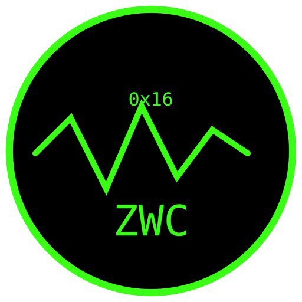

  

# Z_Wave_Console
A modern Z-Wave controller console + reverse-engineering notes for legacy Merten CONNECT devices.

This project documents and preserves the behavior of Merten CONNECT devices (506004, 507001, etc.) and provides tools for interacting with Z-Wave nodes using the Z-Wave Host API. The goal is to make it possible to migrate old CONNECT installations into a modern Z-Wave environment without losing functionality or knowledge.

---

## 📡 Project Overview

This repository contains:

- A custom **Z-Wave Host API console** for debugging and interacting with Z-Wave devices.
- Reverse-engineered documentation for **Merten CONNECT** devices.
- Tools and notes for migrating from CONNECT → modern Z-Wave.
- Packet captures, MultiChannel analysis, and device-specific quirks.
- A public archive of knowledge that was never officially documented.

The project exists because Merten CONNECT documentation is incomplete, and many devices behave differently from standard Z-Wave.

---

## 🔧 Merten 506004 – Parameter 1 Bitmask (Reverse-Engineered)

The 506004 uses a hidden bitmask for its operating mode. Merten only published a few values, but CONNECT uses additional undocumented combinations.

### Bit meanings

| Bit | Value | Meaning |
|-----|--------|---------|
| 0 | 1 | Raise shutter |
| 1 | 2 | Dual event (press + release) |
| 2 | 4 | Switching function |
| 3 | 8 | Doorbell mode |
| 4 | 16 | Toggle / single-surface |
| 5 | 32 | MultiChannel encapsulation |
| 6 | 64 | Unused |
| 7 | 128 | Unused |

### Known values

| Decimal | Hex | Binary | Bits | Meaning |
|---------|------|---------|-------|---------|
| 0 | 0x00 | 00000000 | – | Default dual-surface switching |
| 4 | 0x04 | 00000100 | 2 | Single-surface switching |
| 22 | 0x16 | 00010110 | 1,2,4 | **CONNECT toggle mode (undocumented)** |
| 44 | 0x2C | 00101100 | 2,3,5 | Doorbell |
| 52 | 0x34 | 00110100 | 2,4,5 | Shutter down |
| 54 | 0x36 | 00110110 | 1,2,4,5 | Shutter move |
| 55 | 0x37 | 00110111 | 0,1,2,4,5 | Shutter up |

### CONNECT-specific mode: 22 (0x16)

CONNECT writes **22** when configuring the transmitter.  
This creates the “toggle on all keys” behavior that does not exist in the public Z-Wave database.

<h2>🔧 Merten 506004 – Parameter 1 Bitmask (Reverse-Engineered)</h2>

The 506004 uses a hidden bitmask for its operating mode. Merten only published a few values,
but CONNECT uses additional undocumented combinations.

<h3>Bit meanings</h3>
<table>
  <thead>
    <tr>
      <th>Bit</th>
      <th>Value</th>
      <th>Meaning</th>
    </tr>
  </thead>
  <tbody>
    <tr><td>0</td><td>1</td><td>Raise shutter</td></tr>
    <tr><td>1</td><td>2</td><td>Dual event (press + release)</td></tr>
    <tr><td>2</td><td>4</td><td>Switching function</td></tr>
    <tr><td>3</td><td>8</td><td>Doorbell mode</td></tr>
    <tr><td>4</td><td>16</td><td>Toggle / single-surface</td></tr>
    <tr><td>5</td><td>32</td><td>MultiChannel encapsulation</td></tr>
    <tr><td>6</td><td>64</td><td>Unused</td></tr>
    <tr><td>7</td><td>128</td><td>Unused</td></tr>
  </tbody>
</table>

<h3>Known values</h3>
<table>
  <thead>
    <tr>
      <th>Decimal</th>
      <th>Hex</th>
      <th>Binary</th>
      <th>Bits</th>
      <th>Meaning</th>
    </tr>
  </thead>
  <tbody>
    <tr><td>0</td><td>0x00</td><td>00000000</td><td>–</td><td>Default dual-surface switching</td></tr>
    <tr><td>4</td><td>0x04</td><td>00000100</td><td>2</td><td>Single-surface switching</td></tr>
    <tr><td>22</td><td>0x16</td><td>00010110</td><td>1,2,4</td><td><strong>CONNECT toggle mode (undocumented)</strong></td></tr>
    <tr><td>44</td><td>0x2C</td><td>00101100</td><td>2,3,5</td><td>Doorbell</td></tr>
    <tr><td>52</td><td>0x34</td><td>00110100</td><td>2,4,5</td><td>Shutter down</td></tr>
    <tr><td>54</td><td>0x36</td><td>00110110</td><td>1,2,4,5</td><td>Shutter move</td></tr>
    <tr><td>55</td><td>0x37</td><td>00110111</td><td>0,1,2,4,5</td><td>Shutter up</td></tr>
  </tbody>
</table>

<h3>CONNECT-specific mode: 22 (0x16)</h3>

CONNECT writes <strong>22</strong> when configuring the transmitter.
This creates the “toggle on all keys” behavior that does not exist in the public Z-Wave database.

<h3>⚠️ Parameter persistence quirk</h3>

The 506004 <strong>does store</strong> configuration parameters (e.g. 0x16 for parameters 1–4), and these values
survive a battery change. However, there is a firmware bug in the way the device reports them:

<ul>
  <li>A <code>CONFIGURATION_SET</code> is accepted and used internally.</li>
  <li>The first <code>CONFIGURATION_GET</code> after the write returns the correct value (e.g. 0x16).</li>
  <li>A second (and later) <code>CONFIGURATION_GET</code> for the same parameter incorrectly returns the default 0x04.</li>
</ul>

So the values are actually saved and used by the device, but the reporting logic is faulty on subsequent reads.
In normal CONNECT operation there is no controller-driven interview, so the parameters are written once and then
never read back; the original Merten CONNECT software relies entirely on its own database instead of querying the device.

<h3>Practical implication for modern controllers</h3>
<ul>
  <li>Write the desired value (e.g. 0x16) to parameters 1–4.</li>
  <li>Assume the value is stored and will survive battery replacement.</li>
  <li>Do not trust repeated <code>CONFIGURATION_GET</code> responses; cache the configuration in the controller.</li>
</ul>

---

## 🔒 Merten 507001 – CONNECT-Locked Receivers

The 507001 stores the **CONNECT HomeID** internally.

If the CONNECT configurator was not properly disconnected, the device becomes:

- Non-resettable  
- Non-includable  
- Ignoring the L-button  
- Permanently bound to the old HomeID  

Only the **CONNECT USB radio interface** can reset it.

### Unlocking (if you still have the CONNECT USB stick)

1. Open the CONNECT configurator  
2. Actions → *Connect with radio system*  
3. Put the old admin device into learning mode  
4. USB stick becomes system admin  
5. Remove the 507001  
6. Device resets and becomes Z-Wave compatible  

### Without the USB stick  
The device cannot be recovered.

---

## 🔧 Recommended Replacement: Merten 507501

507501 is the modern Z-Wave-only successor to 507001:

- No CONNECT firmware  
- Always resettable  
- Always includable  
- Standard Z-Wave behavior  
- Safe for future use  

Perfect for migrating away from CONNECT.

---

## 🧪 Z-Wave Host API Tools

This project includes:

- Raw command tests  
- MultiChannel frame decoding  
- Endpoint mapping  
- Sniffer logs  
- Experiments with BASIC_SET, CENTRAL_SCENE, and MultiChannel encapsulation  

Useful for building your own controller or debugging devices.

---

## 📁 Repository Structure

Z_Wave_Console/
│
├── src/                # Console application source code
├── docs/               # Device notes, bitmask tables, CONNECT behavior
├── logs/               # Sniffer logs and packet captures
├── tools/              # Helper scripts and utilities
└── README.md           # This file

---

## 📜 License

MIT — free to use, modify, and share.
